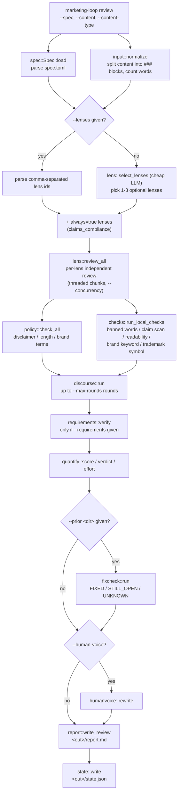
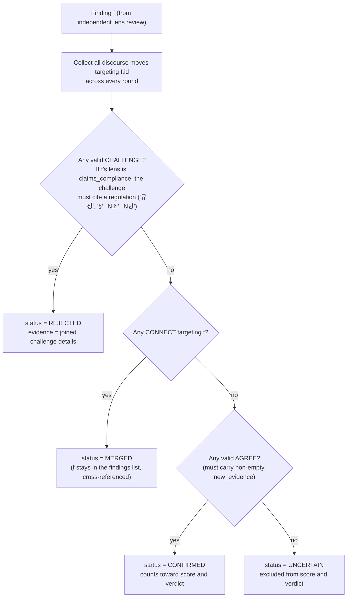
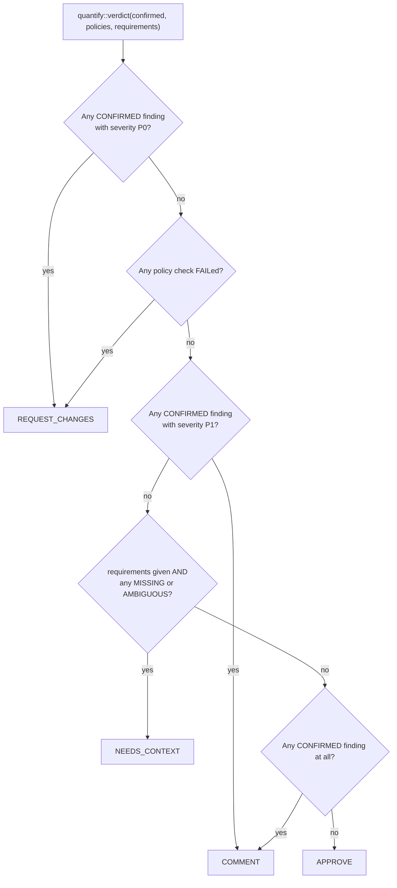
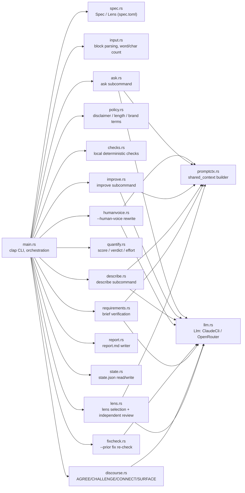

# marketing-loop

A Rust CLI that ports [Code-Review-Loop](https://github.com/Loop-Suite/Code-Review-Loop)'s pattern — **independent persona review → anonymized discourse cross-check → deterministic verdict** — from code review onto marketing content: ad copy, landing pages, email, social posts, and blog posts.

> **Status.** This repository's GitHub description still calls it a "pre-implementation design document." That framing is out of date: `src/` contains 18 Rust source files (`Cargo.lock` present) implementing the full `review` pipeline plus `describe`/`improve`/`ask` subcommands. It is a working CLI, not just a design draft — it has **74 automated unit tests** (`cargo test`) and a **CI workflow** (`.github/workflows/ci.yml`, running `cargo fmt --check`, `cargo check`, and `cargo test` on every push/PR to `main`; see `evals/README.md` for how the suite was built up), though several pieces described in `docs/design-spec.md` were simplified or not carried through into the actual code (see [Known gaps](#known-gaps--where-docs-and-code-diverge)). This README documents what is actually in `src/` and `specs/default.toml`, not the earlier design proposal where the two disagree.

## What it does

Given a piece of marketing copy and a spec of reviewer personas, `marketing-loop review`:

1. picks a handful of relevant personas ("lenses") to review the content independently,
2. runs local, deterministic checks (banned words, disclaimer presence, brand terms, ...) that never touch the LLM,
3. has the personas' findings cross-examine each other anonymously through a structured discourse protocol (`AGREE`/`CHALLENGE`/`CONNECT`/`SURFACE`),
4. resolves each finding to `CONFIRMED`/`REJECTED`/`MERGED`/`UNCERTAIN`,
5. and produces a deterministic verdict (`APPROVE`/`COMMENT`/`REQUEST_CHANGES`/`NEEDS_CONTEXT`) plus a 0-100 score.

The goal of anonymizing reviewer identity during discourse and forcing at least one `CHALLENGE` per round is the same one Code-Review-Loop uses for code review: suppress sycophancy (agreement for agreement's sake) between independent reviewers.

## Pipeline overview



## Review personas (from `specs/default.toml`)

The shipped spec pools 7 lenses, each voiced as a real marketing/copywriting figure to discourage the reviewer LLM from agreeing with itself across lenses:

| Lens id | Title | Persona | Tier | Always included |
|---|---|---|---|---|
| `brand_voice` | Brand Voice | Ann Handley | standard | no |
| `seo` | SEO | Rand Fishkin | standard | no |
| `claims_compliance` | Claims & Compliance | Rebecca Tushnet | blocking | **yes** |
| `conversion_cro` | Conversion / CRO | Peep Laja | standard | no |
| `audience_fit` | Audience Fit | Seth Godin | standard | no |
| `positioning` | Positioning | April Dunford | standard | no |
| `copy_craft` | Copy Craft | David Ogilvy | standard | no |

`tier` is display-only (per `spec.rs`'s own doc comment); it does not affect selection. The `always` boolean is what forces `claims_compliance` into every run regardless of what the lens-selection LLM call picks. `claims_compliance` is deliberately *not* a real compliance officer — the persona (Rebecca Tushnet, a false-advertising-law scholar) is scoped to qualitative risk commentary; final pass/fail on legal-style claims is decided by the deterministic checks in `policy.rs`/`checks.rs`, not by this persona's opinion.

Lens selection is content-driven: `lens::select_lenses` sends the pool (minus always-on lenses) to a cheap LLM call with each lens's `signal` field, and asks it to choose **1-3** optional lenses given the campaign context in `spec.toml`. Manual override is available via `--lenses id1,id2,...`.

## Deterministic checks vs. LLM judgment

```mermaid
flowchart TB
    subgraph DET["Deterministic — local Rust, no LLM call"]
        direction TB
        P1["policy::required_disclaimer_check"]
        P2["policy::content_length_check"]
        P3["policy::brand_terms_check"]
        C1["checks::banned_words"]
        C2["checks::legal_claim_scan"]
        C3["checks::readability_score (approximation)"]
        C4["checks::brand_keyword_match"]
        C5["checks::trademark_symbol_check"]
        C6["7 more checks declared in spec.deterministic_checks<br/>(spelling, links, PII, dup-content, a11y contrast, ...) -<br/>NOT implemented locally, shown as NOT_RUN<br/>unless supplied via --deterministic-results"]
    end
    subgraph LLMJ["LLM judgment — llm::Llm to claude-cli or OpenRouter"]
        direction TB
        L1["lens::review_lens - per-persona findings"]
        L2["discourse::run - AGREE / CHALLENGE / CONNECT / SURFACE"]
        L3["requirements::verify - MET / MISSING / AMBIGUOUS / N/A"]
        L4["fixcheck::run - FIXED / STILL_OPEN / UNKNOWN"]
        L5["humanvoice::rewrite"]
    end
    DET --> V["quantify::verdict<br/>any policy FAIL forces REQUEST_CHANGES,<br/>overriding LLM judgment"]
    LLMJ --> V
```



`specs/default.toml` declares 12 `[[deterministic_checks]]` entries (mirroring the design doc's mapping of Code-Review-Loop's `semgrep` step onto marketing-specific tools), but `checks.rs` only actually computes 5 of them locally:

| `check_id` | Declared tool | Implemented in `checks.rs`? |
|---|---|---|
| `banned_words` | custom wordlist | yes |
| `legal_claim_scan` | custom | yes |
| `readability_score` | textstat / readability-cli | yes, but approximated — average words-per-sentence, not a real Flesch score |
| `brand_keyword_match` | custom | yes |
| `trademark_symbol_check` | custom | yes |
| `required_disclaimer_check` | custom | handled separately, as a `policy.rs` gate — not in this table's engine |
| `channel_length_limit` | custom counter | no — renders `NOT_RUN` |
| `spelling_grammar_check` | LanguageTool (self-host) | no |
| `link_url_validity` | linkinator | no |
| `pii_scan` | custom (gitleaks patterns) | no |
| `duplicate_content_check` | custom (simhash) | no |
| `accessibility_contrast` | pa11y / axe-core | no |

The unimplemented checks aren't dead weight: `--deterministic-results <file.json>` lets you pre-compute them with real tools (LanguageTool, linkinator, pa11y, ...) and feed the `{check_id: {status, evidence}}` JSON straight into the report, bypassing `checks::run_local_checks` entirely.

Separately, three **policy** checks (`policy.rs`) are binary gates that can force the verdict regardless of what the personas or discourse concluded:

| Check | Configured via (`spec.toml`) | Behavior |
|---|---|---|
| Required disclaimer present | `disclaimer_required_types` | `N/A` if `content_type` isn't listed; `PASS` if a disclaimer marker (수신거부 "opt-out", 광고 "ad-disclosure label", or the English opt-out/unsubscribe) is found; else `FAIL` |
| Content length within limit | `content_length_limit` | `NOT_CONFIGURED` if `0`; else `PASS`/`FAIL` against word count |
| Required brand terms present | `required_brand_terms` | `NOT_CONFIGURED` if empty; `PASS` if any required term is found, else `FAIL` |

## Discourse cross-check

Findings from independent lens reviews are anonymized (no persona identity, only `id` / `block_ref` / `severity` / `label` / `claim` / `evidence`) and put in front of a single discourse LLM call per round. The system prompt requires at least one `CHALLENGE` per round; if none appears, the round is retried once and then allowed to pass anyway. `discourse.rs` resolves each finding by priority:



Only `CONFIRMED` findings feed `quantify::score`/`verdict` and appear in the report's main `Findings` table; `REJECTED` and `UNCERTAIN` findings are listed separately for audit purposes.

## Score and verdict



`score` starts at 100 and subtracts a fixed penalty for every `CONFIRMED` finding (floored at 0): `P0=25`, `P1=12`, `P2=5`, `P3=1` — the same hardcoded weights as the original Code-Review-Loop. `effort` (1-5) scales with word count, block count, and lens count, and maps to a best/average/worst time estimate of `effort×5` / `effort×15` / `effort×40` minutes.

## Module architecture



`promptctx::shared_context` builds one context block per run (campaign context → brand guide → requirements → content type → each `### block_id` in order) that every LLM call for that run reuses, so the OpenRouter backend can mark it `cache_control: ephemeral` for repeat cache hits across lens calls.

## Usage

Build:

```sh
cargo build --release
```

Content files use a simple block convention — `### block_id` headers separate addressable units (`headline`, `body`, `cta`, ...) that findings reference via `block_ref` (e.g. `cta_1:0`). See `examples/sample_ad_copy.md`:

```markdown
### headline
Tired at the end of the day? 15 minutes is all you need.

### body
...

### cta
Start your free 15-minute routine now →
```

Run a review against the shipped example:

```sh
marketing-loop review \
  --spec specs/default.toml \
  --content examples/sample_ad_copy.md \
  --content-type ad_copy \
  --out runs/ad-copy-01 \
  --max-rounds 2
```

This defaults to the `claude-cli` backend, which shells out to a `claude` binary on `PATH` (`claude -p --output-format json`, prompt piped over stdin). To use OpenRouter instead:

```sh
export OPENROUTER_API_KEY=sk-or-...
marketing-loop review \
  --backend openrouter --model openai/gpt-oss-120b \
  --spec specs/default.toml --content examples/sample_ad_copy.md --content-type ad_copy
```

Re-review a revised draft and check whether previously confirmed findings got fixed:

```sh
marketing-loop review \
  --spec specs/default.toml --content <revised-draft>.md --content-type ad_copy \
  --out runs/ad-copy-02 --prior runs/ad-copy-01
```

Other subcommands share the same `--spec`/`--content`/`--content-type` inputs but skip lens review and discourse entirely — each is a single LLM call:

```sh
marketing-loop describe --spec specs/default.toml --content examples/sample_ad_copy.md --content-type ad_copy
marketing-loop improve  --spec specs/default.toml --content examples/sample_ad_copy.md --content-type ad_copy
marketing-loop ask      --spec specs/default.toml --content examples/sample_ad_copy.md --content-type ad_copy \
  "Will this resonate with a Gen Z audience?"
```

- `describe` — title, summary, walkthrough, labels, `can_be_split`, and a deterministic `[TBD]`/`lorem ipsum`/`placeholder` scan.
- `improve` — before/after copy rewrite suggestions per block.
- `ask` — free-form Q&A grounded in the content/requirements/brand guide, appended to `<out>/ask.md`.

### Global flags

| Flag | Default | Meaning |
|---|---|---|
| `--backend` | `claude-cli` | `claude-cli` (subprocess) or `openrouter` (REST, needs `OPENROUTER_API_KEY`) |
| `--claude-bin` | `claude` | binary name/path for the `claude-cli` backend |
| `--model` | — | model for lens review, discourse, human-voice rewrite |
| `--cheap-model` | same as `--model` | model for lens selection, requirements verification, fix-check (cheaper, classification-style calls) |
| `--retries` | `2` | retries per LLM call |
| `--verbose` | off | print retry diagnostics to stderr |

### CLI-to-LLM call sequence (`review`)

```mermaid
sequenceDiagram
    actor U as User
    participant CLI as marketing-loop CLI
    participant Llm as llm::Llm
    participant Backend as claude -p subprocess<br/>or OpenRouter API

    U->>CLI: marketing-loop review --spec ... --content ...
    CLI->>Llm: select_lenses (cheap model)
    Llm->>Backend: lens catalog + campaign context
    Backend-->>Llm: JSON {selected: [...]}
    loop per selected lens, chunked by --concurrency
        CLI->>Llm: review_lens (main model)
        Llm->>Backend: shared_context + lens task
        Backend-->>Llm: JSON {findings: [...]}
    end
    loop discourse rounds, up to --max-rounds
        CLI->>Llm: discourse round (main model)
        Llm->>Backend: anonymized findings catalog
        Backend-->>Llm: JSON {moves: [AGREE|CHALLENGE|CONNECT|SURFACE]}
    end
    opt --requirements given
        CLI->>Llm: requirements::verify (cheap model)
        Llm->>Backend: confirmed findings + requirements text
        Backend-->>Llm: JSON {checks: [...]}
    end
    opt --human-voice
        CLI->>Llm: humanvoice::rewrite (main model)
        Llm->>Backend: confirmed findings
        Backend-->>Llm: plain-text rewrite
    end
    CLI-->>U: &lt;out&gt;/report.md + &lt;out&gt;/state.json
```

## `report.md` / `state.json`

`report.md` sections, in order: verdict/score/effort header, prior-round comparison (if `--prior`), Policy checks, quantitative summary (score breakdown), Requirements Verification, Findings (CONFIRMED only, sorted by severity) with a rejected-candidates and uncertain-items appendix, Good Things, Deterministic checks, Discourse audit, Human-voice review (if `--human-voice`).

`state.json` — written on every `review` run, read back via `--prior` — is exactly:

```json
{ "round": 0, "findings": [ /* Finding[] */ ], "resolved": { "finding-id": { "status": "CONFIRMED", "evidence": "..." } } }
```

## Project layout

```
Cargo.toml / Cargo.lock      bin "marketing-loop", edition 2021
src/                         18-file Rust implementation (see architecture diagram above)
specs/default.toml           the 7-lens spec that actually ships and runs
examples/sample_ad_copy.md   one sample content file (block-marker format)
docs/design-spec.md          12-stage Code-Review-Loop -> marketing-loop mapping, design rationale
docs/research-and-evidence-survey-2026-07-29.md   survey of adjacent OSS/marketing-automation/discourse-pattern prior art
```

## Known gaps / where docs and code diverge

- 7 of the 12 `deterministic_checks` declared in `specs/default.toml` are actually computed: `banned_words`, `legal_claim_scan`, `readability_score`, `brand_keyword_match`, `trademark_symbol_check` (`checks.rs`), plus `required_disclaimer_check` and `channel_length_limit` (computed by `policy.rs`, folded into the deterministic-checks table). The remaining 5 — `spelling_grammar_check`, `link_url_validity`, `pii_scan`, `duplicate_content_check`, `accessibility_contrast` — each need a real external tool integration (LanguageTool, linkinator, gitleaks-style patterns, simhash, pa11y/axe-core) and still render `NOT_RUN` in `report.md` unless supplied via `--deterministic-results`; tracked in [#31](https://github.com/Loop-Suite/Marketing-Loop/issues/31).
- `readability_score` is a words-per-sentence approximation, not a real Flesch-Kincaid/Reading-Ease calculation.
- The persona roster that ships in `specs/default.toml` (Handley/`brand_voice`, Fishkin/`seo`, Tushnet/`claims_compliance`, Laja/`conversion_cro`, Godin/`audience_fit`, Dunford/`positioning`, Ogilvy/`copy_craft`) differs from the earlier roster proposed in `docs/design-spec.md` (which paired different personas, e.g. Cialdini and Hopkins, to lens ids like `clarity_style`/`cross_channel_consistency` that don't exist in the shipped spec).
- `lens.rs`'s selection prompt asks for **1-3** optional lenses per run, not the "3-5" figure quoted in `docs/design-spec.md`.
- `state.json` persists the original 3-field `{round, findings, resolved}` schema; the expanded schema proposed in `docs/design-spec.md` §6 (`run_id`, `timestamp`, `discourse_log`, ...) was not implemented in `state.rs`.
- `report.rs`'s Good Things section is hardcoded to "not observed" — nothing in the current pipeline populates `humanvoice::GoodThing` values, even though the struct exists.

## Real-world validation

The pipeline above wasn't just read — it was reviewed, hardened, and actually run, twice. An
initial validation pass (two static code-reading passes, one round of real `codereview review`
executions) found 9 issues; a later **production-hardening round** (an adversarial third static
pass, this repo's first unit test suite, a tagged `v0.1.0` release, and a second real-execution
pass that chained two rounds together with `--prior`) found 5 more. **14 issues total, all
fixed**, for a real combined execution cost of **~$1.78–$1.98**. Every dollar figure is read off
actual CLI cost output, computed from a saved `report.md`, or — for the second execution pass —
read directly off live console output during the session (not saved to a log in this snapshot).
This repo now also has 73 unit tests (previously zero) and a `CHANGELOG.md`.

Findings worth calling out:

- **A finding-id collision silently distorted the verdict.** A round's own local finding id could
  collide with a re-confirmed `--prior` finding's id, letting a `REJECTED` finding get resurrected
  as `CONFIRMED` and double-counted into the score — a run that should have scored 95 scored 90
  instead.
- **The MERGED-findings feature had never once actually worked.** `report.md`'s "Merged Findings"
  section rendered correctly from the day it was added, but the underlying `CONNECT` move that was
  supposed to populate it never matched anything, because the model returns multiple target
  finding ids as one comma-joined string against a field typed to hold only one. The section
  looked correct and was silently empty in every real run until this was found.
- **A blocking-tier compliance violation could discourse-merge its way to a 100/100 score — and
  now can't.** Real `claims_compliance` findings (unsubstantiated efficacy/guarantee claims) lost
  all scoring weight the moment discourse `CONNECT`ed them, observed directly on a real run.
  Decided and fixed: blocking-tier findings now count toward score/verdict even when merged;
  non-blocking-tier findings keep the original consolidation behavior. Re-validated on a real
  chained run: two merged `claims_compliance` findings correctly held the score at 76/100 instead
  of the 100/100 they'd have produced before the fix.
- **The `--prior` round-chaining that fix depended on had its own gap.** A blocking-tier finding
  scored via `MERGED` (not `CONFIRMED`) was invisible to the next round's fix-check tracking — no
  "Vs. previous round" section rendered at all, even though the prior round had real,
  score-affecting findings to carry forward. Fixed and covered by a regression test; not
  re-validated against another paid run.

**The tagged `v0.1.0` release is stale**: it was cut before the second execution pass, so the
lens-selection crash fix and the `--prior` tracking-gap fix above exist only on `main`, not in the
`v0.1.0` tag.

Full methodology, every raw number, and everything else that went wrong along the way:
[evals/README.md](evals/README.md).

## License

No license file is included in this repository as of this snapshot.
